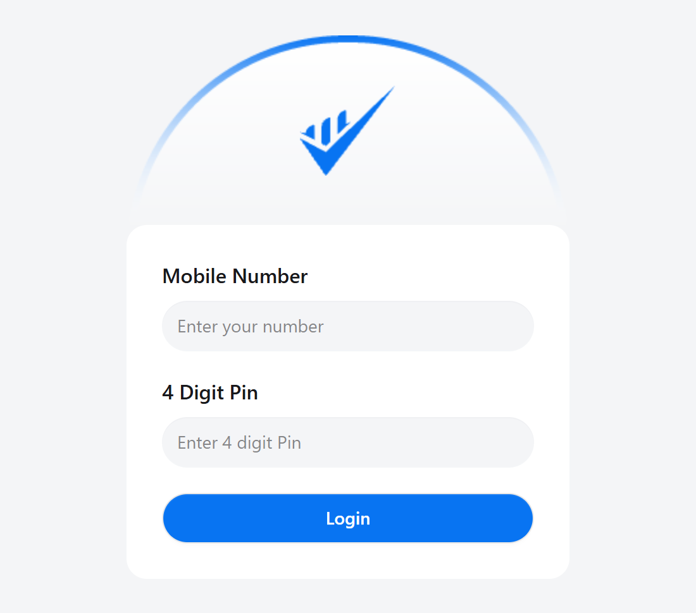
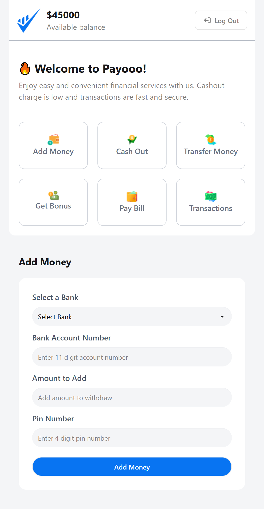
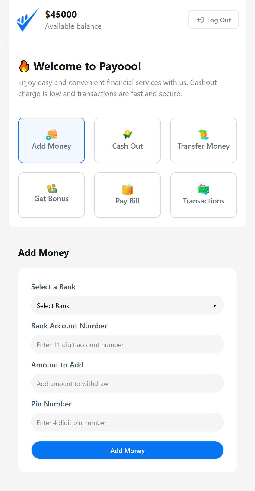
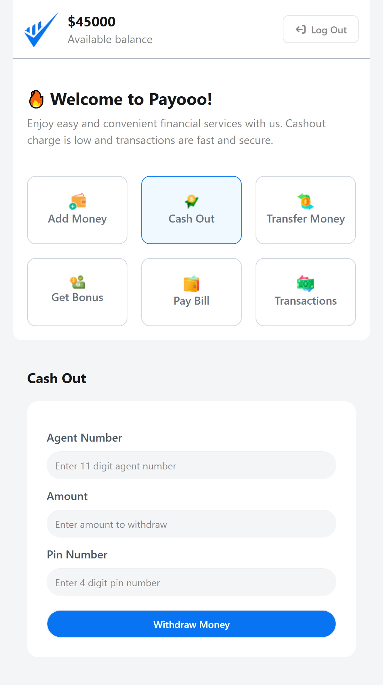
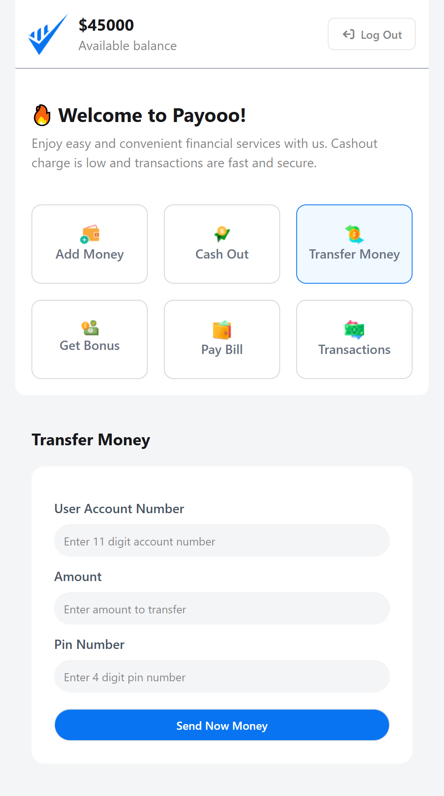
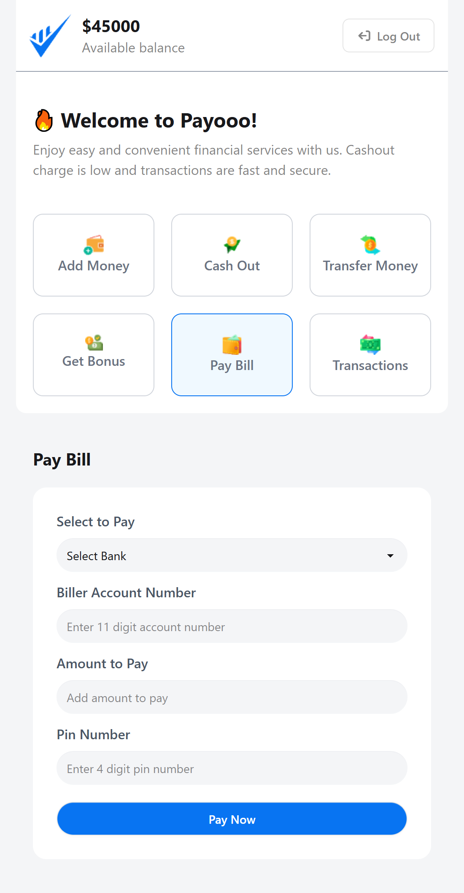
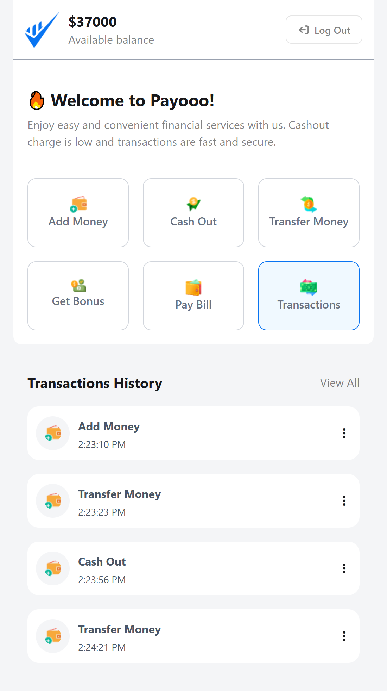

# PAYOO — Smart MFS Interface

## Overview

PAYOO is a smart **Mobile Financial Services (MFS)** interface delivering a seamless digital banking experience. Built with **HTML**, **CSS**, **DaisyUI**, and **Vanilla JavaScript**, the application provides a clean, responsive platform for managing money transfers and financial transactions.

Key capabilities include adding money, cashouts, bonus rewards, and a comprehensive transaction history — all secured behind PIN-based authentication.

## Tech Stack

| Layer | Technology |
|---|---|
| Markup | HTML5 |
| Styling | CSS3, Tailwind CSS, DaisyUI |
| Logic | Vanilla JavaScript (ES6+) |
| Icons | Font Awesome |

## Features

- **Secure Login Interface** — Username and password authentication flow
- **Home Dashboard** — Real-time balance display with quick-access service cards
- **Add Money** — Deposit funds into a PAYOO account with form validation
- **Cash Out** — PIN-verified withdrawal with confirmation flow
- **Money Transfer** — Peer-to-peer transfers with recipient lookup and PIN confirmation
- **Bonus Rewards** — Earn and track promotional cashbacks and bonuses
- **Transaction History** — Paginated, filterable log of all financial activity
- **PIN Security System** — Every transaction requires PIN authentication for enhanced security
- **Responsive Design** — Optimised for all screen sizes using DaisyUI component system

## Key Highlights 

- Implemented a **multi-screen SPA architecture** in Vanilla JS with dynamic view rendering — no frameworks
- Designed a **PIN authentication layer** applied uniformly across all transaction types
- Built a **transaction ledger system** that persists state across user sessions
- Achieved a **fully responsive UI** using DaisyUI's component system with custom Tailwind overrides
- Delivered a complete financial product UI with **8 distinct screens** and consistent UX patterns

## UI Screenshots

<table>
  <tr>
    <td></td>
    <td></td>
  </tr>
  <tr>
    <td></td>
    <td></td>
  </tr>
  <tr>
    <td></td>
    <td></td>
  </tr>
  <tr>
    <td></td>
    <td></td>
  </tr>
</table>

